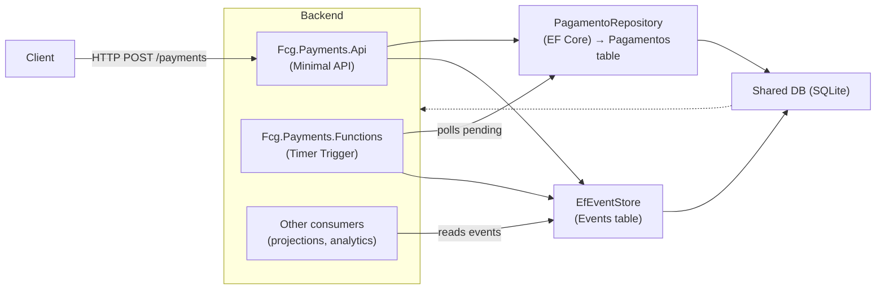
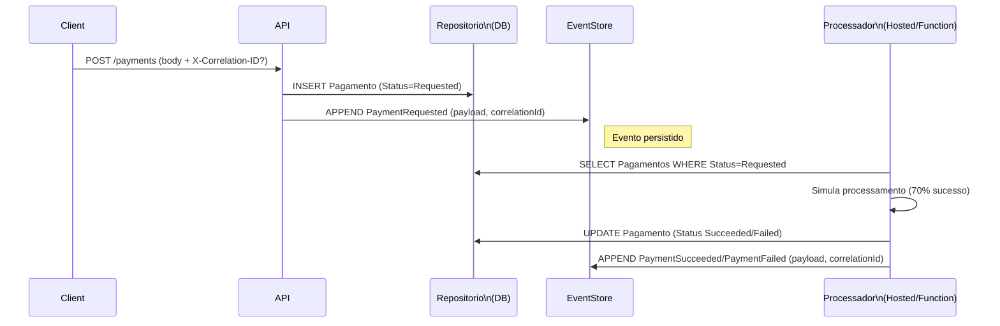

Fcg Payments Service
====================

Resumo
------
Projeto exemplo de um serviço de pagamentos minimalista implementado em .NET 10. Ele contém:

- `Fcg.Payments.Api`: uma API minimal com endpoints para criar/consultar/reprocessar pagamentos e um endpoint para consultar o Event Store.
- `Fcg.Payments.Functions`: um host Azure Functions (timer trigger) que processa pagamentos pendentes (simulação).
- Persistência usando EF Core + SQLite (migrations incluídas).
- Event Store (tabela `Events`) onde todos os eventos do domínio são append-only.

Objetivo: demonstrar um fluxo de pagamentos orientado a eventos com processamento assíncrono e reprocessamento.

Visualização (diagramas)
------------------------
Incluí dois diagramas em `mermaid` para facilitar a visualização do fluxo e da arquitetura. Se o visualizador não renderizar `mermaid`, há um diagrama ASCII de fallback abaixo.

Diagrama de arquitetura (Mermaid - flowchart)

Fluxo de comunicação (Mermaid - sequence)

Fallback ASCII (se `mermaid` não renderizar)

 Client
   |
   | HTTP (POST /payments)
   v
 `Fcg.Payments.Api` (Minimal API)
   |- `PagamentoRepository` (EF Core) -> `Pagamentos` table
   |- `EfEventStore` (EF Core) -> `Events` table
   |- `PaymentProcessorHostedService` (opcional)

 Shared Database (SQLite)
   /            \
  /              \
 v                v
`Fcg.Payments.Functions`  Other consumers (projections, analytics)

Melhorias de visualização
-------------------------
- `mermaid` permite gerar diagramas diretamente no `README.md` em plataformas que o suportam (GitHub, VS Code Markdown Preview com plugin, etc.).
- Se desejar, eu posso gerar uma imagem PNG/SVG dos diagramas e adicioná-la ao repositório (em `docs/`), para garantir renderização em qualquer visualizador.

Próximos passos sugeridos
-------------------------
- Deseja que eu gere imagens (`PNG`/`SVG`) dos dois diagramas e as adicione em `docs/`? Isso garante compatibilidade de visualização em todos os navegadores e plataformas.
- Quer que eu adicione um diagrama mais detalhado (ex.: deploy, redes, portas, containers, GitHub Actions) ou mantenha o nível atual?

Componentes principais
----------------------
- `Pagamento` (entidade): representa um pagamento com campos `Id`, `UserId`, `GameId`, `Amount`, `Status`, `DataCriacao`.
  - Status possíveis: `Requested (1)`, `Succeeded (2)`, `Failed (3)`.
- Repositório: `IPagamentoRepository` / `PagamentoRepository` usando `PagamentoDbContext` (EF Core).
- Event Store: `IEventStore` / `EfEventStore` que grava `EventEntity` (EventId, AggregateId, EventType, OccurredAt, Version, CorrelationId, Payload) na tabela `Events`.
- Processadores de pagamento:
  - `PaymentProcessorHostedService` (background service na API) — verifica pendentes a cada 5s.
  - `PaymentProcessorFunction` (Azure Function timer) — executa a cada 10s.

Endpoints principais
--------------------
- POST `/payments` (criar pagamento)
- GET `/payments/{id}` (consultar pagamento)
- GET `/payments/by-user/{userId}`
- POST `/payments/{id}/reprocess` (reprocessamento)
- GET `/events/{aggregateId}`

Como executar
-------------
Veja a seção original (acima) para instruções de execução local e com Docker.

Licença
-------
Projeto de exemplo — adapte conforme necessidade.
