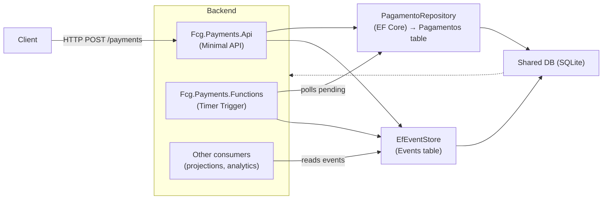
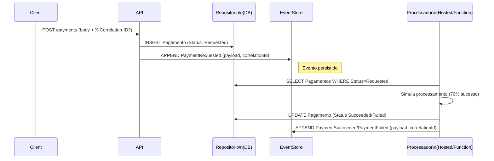

FIAP Cloud Games - Serviço de Pagamentos
======================================

[](https://dotnet.microsoft.com/)
[](https://azure.microsoft.com/services/container-apps/)
[](LICENSE)

> **MVP – Microsserviço de Pagamentos (simulado, orientado a eventos)**

API RESTful desenvolvida em **.NET 10** para criação e processamento assíncrono de pagamentos. Simula processamento com um worker (HostedService) e um Azure Function (timer) e persiste eventos em um Event Store (append-only).

---

## 📋 Sumário

- [Visão Geral](#-visão-geral)
- [Arquitetura](#-arquitetura)
- [Tecnologias](#-tecnologias)
- [Funcionalidades](#-funcionalidades)
- [Estrutura do Projeto](#-estrutura-do-projeto)
- [Fluxo de Comunicação](#-fluxo-de-comunicação)
- [Pré-requisitos](#-pré-requisitos)
- [Instalação e Execução](#-instalação-e-execução)
- [Endpoints da API](#-endpoints-da-api)
- [Docker](#-docker)
- [Health Checks](#-health-checks)
- [Event Sourcing](#-event-sourcing)
- [Variáveis de Ambiente](#-variáveis-de-ambiente)
- [Validações](#-validações)
- [Segurança](#-segurança)

---

## 🎯 Visão Geral

O **FCG Payments Service** é um microsserviço responsável por receber pedidos de pagamento, persistir o estado inicial e publicar eventos no Event Store. Um processador assíncrono (HostedService ou Function) consome pagamentos pendentes, simula o resultado e publica eventos de sucesso/falha.

---

## 🏗️ Arquitetura

### Diagrama de Arquitetura do Sistema



### Diagrama de Sequência (Fluxo de pagamento)



---

## 🛠️ Tecnologias

| Categoria | Tecnologia | Versão |
|-----------|-----------|--------|
| **Framework** | .NET | 10.0 |
| **API** | ASP.NET Core Minimal APIs | 10.0 |
| **Database** | SQLite | - |
| **ORM** | Entity Framework Core | 10.0 |
| **Validação** | FluentValidation | 11.x |
| **Functions** | Azure Functions (dotnet-isolated) | 4 |
| **Container** | Docker | - |
| **Logging** | Microsoft.Extensions.Logging | - |

---

## ⚡ Funcionalidades

- ➕ Criar pagamento (`PaymentRequested`) com validação básica
- 🔎 Consultar pagamento por id e listar por usuário
- ♻️ Reprocessamento de pagamentos com status `Failed` (cria novo pagamento)
- ⚙️ Processamento assíncrono (HostedService + Azure Function timer)
- 📝 Event Store append-only para auditoria
- 🔁 Correlation ID opcional via header `X-Correlation-ID`

---

## 📁 Estrutura do Projeto (exemplo)

```
Fcg.Payments.Api/
├── Api/
│   └── Endpoints/
│       ├── PagamentosEndpoints.cs
│       └── EventsEndpoints.cs
├── Application/
│   └── Pagamentos/
│       ├── Request.cs
│       └── Response.cs
├── Domain/
│   ├── Entidades/
│   │   └── Pagamento.cs
│   └── Enum/
│       └── PagamentoStatusEnum.cs
├── Infra/
│   ├── Events/
│   │   ├── EventEntity.cs
│   │   ├── IEventStore.cs
│   │   └── EfEventStore.cs
│   ├── Repositorio/
│   │   └── PagamentoRepository.cs
│   └── PagamentoDbContext.cs
├── Setup/
│   ├── ServiceCollectionExtensions.cs
│   └── WebApplicationExtensions.cs
├── Program.cs
├── Dockerfile
└── Migrations/
```

---

## 🔄 Fluxo de Comunicação

- Cliente -> API: cria pagamento (POST /payments).
- API persiste `Pagamento` (Status = Requested) e grava `PaymentRequested` no Event Store.
- Processador (HostedService ou Function) consulta pendentes, processa (simulação) e grava `PaymentSucceeded` ou `PaymentFailed` no Event Store.
- Consumidores externos podem ler tabela `Events` para projeções/integrações.

---

## 📋 Pré-requisitos

- [.NET 10 SDK](https://dotnet.microsoft.com/download/dotnet/10.0)
- (Opcional) [Azure Functions Core Tools] para rodar `Fcg.Payments.Functions` localmente
- Docker (opcional)

---

## 🚀 Instalação e Execução

### Executar API localmente

1. Abrir terminal na pasta do projeto e executar:

```sh
cd Fcg.Payments.Api
dotnet run
```

A API estará disponível na porta configurada (ex.: 8080).

### Executar Functions localmente (opcional)

```sh
cd Fcg.Payments.Functions
func start
```

> Observação: `Fcg.Payments.Functions` aplica migrations automaticamente na inicialização.

---

## 📡 Endpoints da API

Base URL (ex.): `https://localhost:8080`

- POST `/payments` — cria pagamento
  - Body: `{ "userId": "guid", "gameId": "guid", "amount": decimal }`
  - Header opcional: `X-Correlation-ID: <guid>`
  - Resposta: `201 Created` com `PagamentoResponse`

- GET `/payments/{id}` — obter pagamento
- GET `/payments/by-user/{userId}` — lista do usuário
- POST `/payments/{id}/reprocess` — reprocessar (AdminOnly)
- GET `/events/{aggregateId}` — eventos do aggregate

Exemplo de criação:

```sh
curl -X POST http://localhost:8080/payments \
  -H "Content-Type: application/json" \
  -H "X-Correlation-ID: <guid>" \
  -d '{"userId":"<guid>","gameId":"<guid>","amount":9.99}'
```

---

## 🐳 Docker

### API

```sh
docker build -f Fcg.Payments.Api/Dockerfile -t fcg-payments-api:local .
docker run -p 8080:8080 fcg-payments-api:local
```

### Functions (container)

```sh
docker build -f Fcg.Payments.Functions/Dockerfile -t fcg-payments-functions:local .
docker run -p 80:80 fcg-payments-functions:local
```

---

## 🏥 Health Checks

- `/health` — liveness
- `/health/ready` — readiness (checa disponibilidade do banco)

---

## 📊 Event Sourcing

Entidade de evento usada pelo Event Store:

```csharp
public sealed class EventEntity
{
    public Guid EventId { get; set; }
    public Guid AggregateId { get; set; }
    public string EventType { get; set; }
    public DateTime OccurredAt { get; set; }
    public int Version { get; set; }
    public Guid? CorrelationId { get; set; }
    public string Payload { get; set; }
}
```

Tipos de eventos presentes no fluxo:

- `PaymentRequested`
- `PaymentSucceeded`
- `PaymentFailed`

---

## ⚙️ Variáveis de Ambiente

| Variável | Descrição | Padrão | Obrigatório |
|----------|-----------|--------|-------------|
| `ASPNETCORE_ENVIRONMENT` | Ambiente de execução | `Development` | Não |
| `ConnectionStrings__DefaultConnection` | String de conexão SQLite | `Data Source=fcg.db` | Não |

Exemplo `appsettings.json`:

```json
{
  "ConnectionStrings": {
    "DefaultConnection": "Data Source=fcg.db"
  }
}
```

---

## ✅ Validações

- `userId` e `gameId` devem ser GUIDs válidos
- `amount` deve ser > 0

As validações são aplicadas via `FluentValidation`.

---

## 🔒 Segurança

- Exemplos de autorização estão aplicados em endpoints (regras como `AdminOnly` para reprocessamento).
- Em produção, executar via HTTPS e proteger o acesso ao banco.

---

## 📄 Licença

Projeto de exemplo — adaptar conforme necessidade.

---

## 📞 Contato

**FIAP Cloud Games Team**

- Repositório: https://github.com/gustavo4869/fcg-payments-service

---

**Desenvolvido com ❤️ usando .NET 10**
